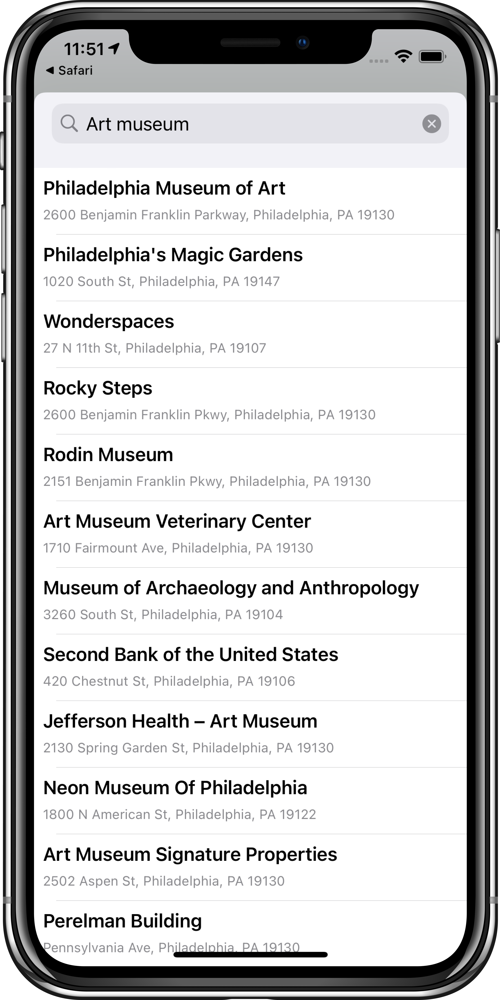
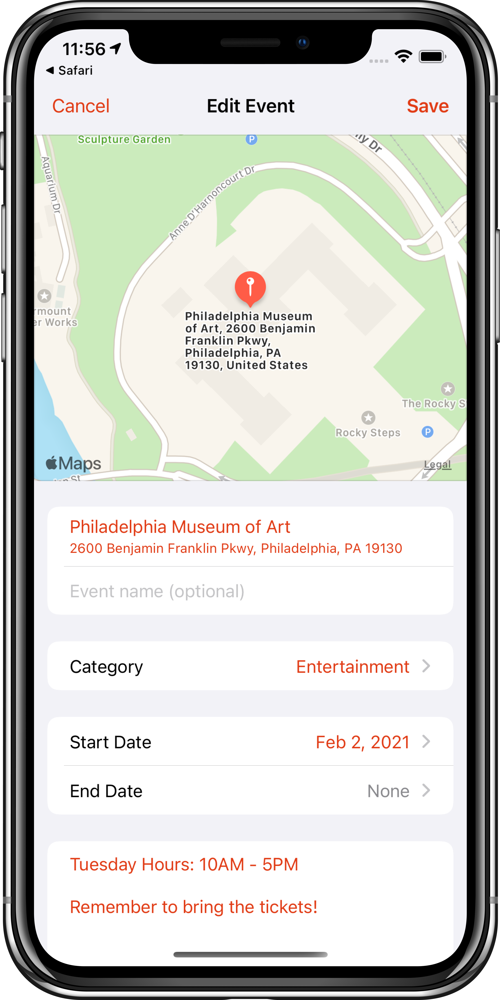
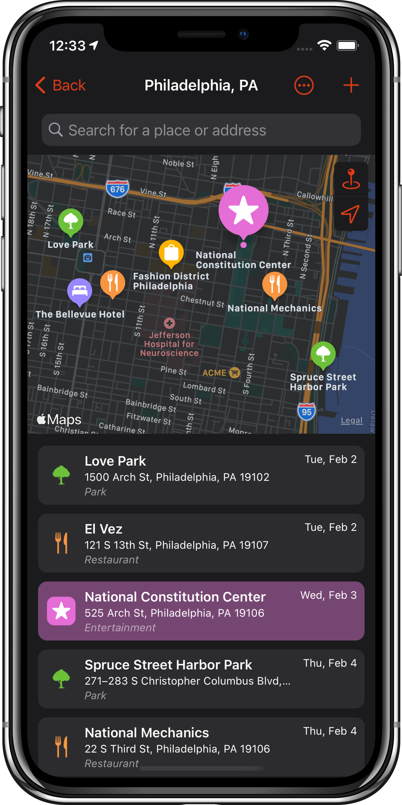
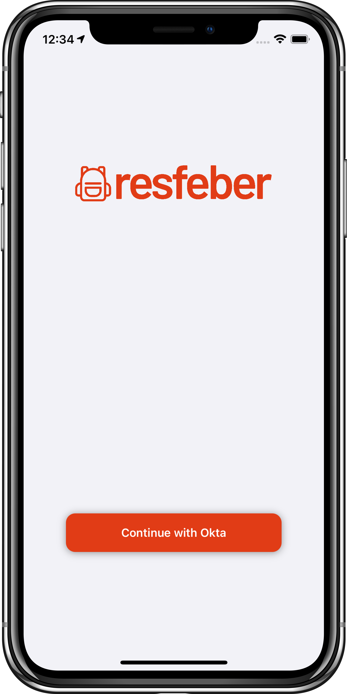
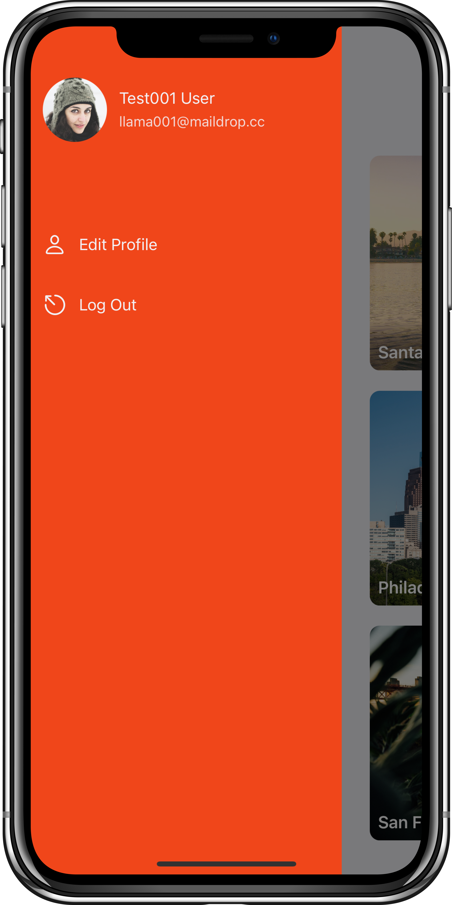

# 

🧭 Resfeber (RACE-fay-ber). *Origin: Swedish*  - The restless race of the traveler’s heart before the journey begins, when anxiety and anticipation are tangled together.  That is the feeling we want our users to experience when planning their travels with this app. 🧳

# Plan your upcoming trips with the Resfeber app! &nbsp;
**Note:** This app is still under development and is not yet available on the App Store.

 

## Create a trip and search for locations to save to your trip

&nbsp;&nbsp;
&nbsp;&nbsp;

- You can save other important information about a location such as dates and notes
- You can also select a category to help keep all the locations saved to your trip organized

  

## View all your saved locations on a map (light and dark mode support)

&nbsp;&nbsp;&nbsp;&nbsp;&nbsp;&nbsp;

  

## Uses Okta authentication for quick and secure log in

&nbsp;&nbsp;

- Your saved trips are synced to the cloud so you can access and update your trip data from multiple devices
- All trip data is also stored locally on the device, so you can still access and update your trips with airplane mode activated

  

# Roadmap
🗺 This describes the current status and the upcoming milestones of the Resfeber app.

*Updated: Thu, 04 Feb 2021 07:43:21 GMT*

| Status | Milestone | Goals | Label | Release Candidate
| :---: | :--- | :---: | :---: | :---: |
| ✔ | **Authentication** | 1 / 1 | `Complete`| `Release 1`| 
| ✔ | **Create Trip** | 2 / 2 | `Complete`|`Release 1`| 
| ✔ | **Travel Itinerary** | 3 / 3 | `Complete`|`Release 1`| 
| ✔ | **MapKit Integration** | 2 / 2 | `Complete`|`Release 1`| 
| - | **Travel Information/Data** | 0 / 2 | `not yet started`|`Release 2`| 
| - | **Scheduled Travel Details** | 0 / 3 | `not yet started`|`Release 3`| 
| - | **Flight Tracking** | 0 / 2 | `not yet started`|`Release 4`| 

 

# Contributors

|                                                      [David Wright](https://github.com/DavidWrightOS)                                                       |                                                       [Josh Rutkowski](https://github.com/joshrutkowski)                        
| :-----------------------------------------------------------------------------------------------------------------------------------------: | :-------------------------------------------------------------------------------------------------------------------------------------------: | 
|  |  |
|                                                                |                                                         |  
|                                |                                  | 

 

## [Trello Board](https://trello.com/b/wdLAv0aT/resfeber-carter-team)  

  

# Contributing

When contributing to this repository, please first discuss the change you wish to make via issue, email, or any other method with the owners of this repository before making a change.

Please note we have a [code of conduct
](./CODE_OF_CONDUCT.md). Please follow it in all your interactions with the project.

## Issue/Bug Request 🐛

**If you are having an issue with the existing project code, please submit a bug report under the following guidelines:**

- Check first to see if your issue has already been reported.
- Check to see if the issue has recently been fixed by attempting to reproduce the issue using the latest master branch in the repository.
- Create a live example of the problem.
- Submit a detailed bug report including your environment & browser, steps to reproduce the issue, actual and expected outcomes, where you believe the issue is originating from, and any potential solutions you have considered.

### Feature Requests

We would love to hear from you about new features which would improve this app and further the aims of our project. Please provide as much detail and information as possible to show us why you think your new feature should be implemented.

### Pull Requests

If you have developed a patch, bug fix, or new feature that would improve this app, please submit a pull request. It is best to communicate your ideas with the developers first before investing a great deal of time into a pull request to ensure that it will mesh smoothly with the project.

Remember that this project is licensed under the MIT license, and by submitting a pull request, you agree that your work will be, too.

#### Pull Request Guidelines

- Update the README.md with details of changes
- Ensure that your code conforms to our existing code conventions and test coverage.
- Include the relevant issue number, if applicable.
- You may merge the Pull Request in once you have the sign-off of one other developer.
